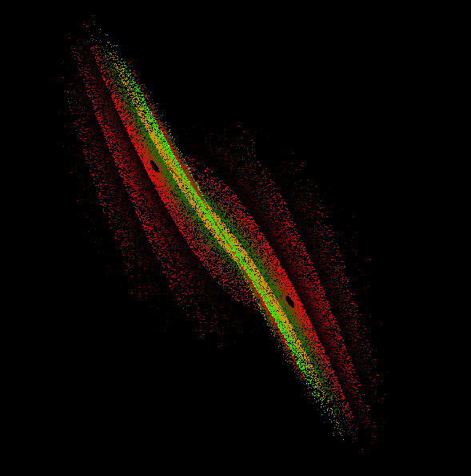

<h2>My Shitty Lorenz System Simulation???</h2>
  <a href="https://en.wikipedia.org/wiki/Lorenz_system" target="_blank">Original Source so you can interprete in your own way</a>

This project is not the actual representation of
this concept you can probably find a ton of other
perfect 1:1 representation of this project on some
youtube video or a blog. This is just my
interpretation and a little bit of fun. This is not
trying to copy the system but instead a way of
understanding both the math behind it while
learning rust at the same time.

Output::

 
